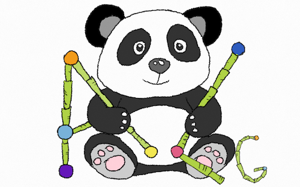

# 🧠 📚 ⏱ Java Common Data Structures and Algorithms

<center>
	
</center>

- Implementation of Data Structures and Algorithms.

**Helping welcome! Thanks!**

 📌 *notation keys:*:
 - `🍏` - easy;
 - `🍊` - medium;
 - `🍎` - hard;
 - `⭕️(1)`, `⭕️log(N)`, `⭕️(N^2)`... - Time and Space Complexity;
 - [`✍🏻`] - in progress;
 - [`🙇🏻‍♂️`] - hard to solve;
 - [`❓`] - the solution is not optimal;
 - [`✔️`] - done;
 - [`🆗`] - Test passed Ok;


#### Data Structure: [**Arrays**](src/main/java/dataStructures/arrays) 

Algorithm (operation)| Level |  Done  |  Big ⭕️ Notation  | Tests passed:
---------------------|-------|--------|-------------------|---------------
[findMin](src/main/java/dataStructures/arrays/Arrays.java#L45) | `🍏` | [`✔️`] | `⭕️(N)`| [`🆗`] [Open](src/test/java/dataStructures/arrays/ArraysTest.java#L14)
 merge |`🍏`|[`✍🏻`]
[pop](src/main/java/dataStructures/arrays/Arrays.java#L20)|`🍏`|[`✔️`]|`⭕️(N)`| [`🆗`] [Open](src/test/java/dataStructures/arrays/ArraysTest.java#L44)
[push](src/main/java/dataStructures/arrays/Arrays.java#L7)|`🍏`|[`✔️`]|`⭕️(N)`| [`🆗`] [Open](src/test/java/dataStructures/arrays/ArraysTest.java#L61)
[remove(position)](src/main/java/dataStructures/arrays/Arrays.java#L63)|`🍏`|[`✔️`]|`⭕️(N)`| [`🆗`] [Open](src/test/java/dataStructures/arrays/ArraysTest.java#L26)
[reverse](src/main/java/dataStructures/arrays/Arrays.java#L87)|`🍊`|[`✔️`]|`⭕️(N)`| [`🆗`] [Open](src/test/java/dataStructures/arrays/ArraysTest.java#L78)
[reverse(start, end)](src/main/java/dataStructures/arrays/Arrays.java#L102)|`🍊`|[`✔️`]|`⭕️(N)`
[size](src/main/java/dataStructures/arrays/Arrays.java#L31)|`🍏`|[`✔️`]|`⭕️(N)`| [`🆗`] [Open](src/test/java/dataStructures/arrays/ArraysTest.java#L95)
[sort](src/main/java/dataStructures/arrays/Arrays.java#L117)|`🍊`|[`✔️`]|`⭕️(N^2)`| [`🆗`] [Open](src/test/java/dataStructures/arrays/ArraysTest.java#L109)
[GenericArray \<T\>](src/main/java/generics/GenericArray.java)|`🍊`| |


 #### Data Structure: [**Matrix**](src/main/java/dataStructures/matrix)

Algorithm (operation)| Level |  Done  |  Big ⭕️ Notation | Tests passed
---------------------|-------|--------|------------------|--------------
[rotate](src/main/java/dataStructures/matrix/Matrix.java#L15)|`🍊`|[`✔️`]|`⭕️(N^2)` | [`🆗`] [Open](src/test/java/dataStructures/matrix/MatrixTest.java#L10)
[transpose](src/main/java/dataStructures/matrix/Matrix.java#L24)|`🍊`|[`✔️`]|`⭕️(N^2)` | [`🆗`] [Open](src/test/java/dataStructures/matrix/MatrixTest.java#L29)
[reflect](src/main/java/dataStructures/matrix/Matrix.java#L37)|`🍊`|[`✔️`]|`⭕️(N^2)` | [`🆗`] [Open](src/test/java/dataStructures/matrix/MatrixTest.java#L48)

#### Data Structure: [**Singly Linked List**](src/main/java/dataStructures/singlyLinkedList)

Algorithm (operation)| Level |  Done  |  Big ⭕️ Notation | Tests passed
---------------------|-------|--------|------------------|--------------
[append(data)](src/main/java/dataStructures/singlyLinkedList/SinglyLinkedList.java#L7)|`🍏`|[`✔️`]|`⭕️(1)`| [`🆗`] [Open](src/test/java/dataStructures/singlyLinkedList/SinglyLinkedListTest.java#L79)
[preppend(data)](src/main/java/dataStructures/singlyLinkedList/SinglyLinkedList.java#L28)|`🍏`|[`✔️`]|`⭕️(N)`| [`🆗`] [Open](src/test/java/dataStructures/singlyLinkedList/SinglyLinkedListTest.java#L97)
[find(data)](src/main/java/dataStructures/singlyLinkedList/SinglyLinkedList.java#L136)|`🍏`|[`✔️`]|`⭕️(N)`| [`🆗`] [Open](src/test/java/dataStructures/singlyLinkedList/SinglyLinkedListTest.java#L165)
[deleteFirst()](src/main/java/dataStructures/singlyLinkedList/SinglyLinkedList.java#L110)|`🍏`|[`✔️`]|`⭕️(N)`| [`🆗`] [Open](src/test/java/dataStructures/singlyLinkedList/SinglyLinkedListTest.java#L131)
[deleteLast()](src/main/java/dataStructures/singlyLinkedList/SinglyLinkedList.java#L7)|`🍏`|[`✔️`]|`⭕️(1)`| [`🆗`] [Open](src/test/java/dataStructures/singlyLinkedList/SinglyLinkedListTest.java#L148)
[deletePos(position)](src/main/java/dataStructures/singlyLinkedList/SinglyLinkedList.java#L114)|`🍏`|[`✔️`]|`⭕️(N)`| [`🆗`] [Open](src/test/java/dataStructures/singlyLinkedList/SinglyLinkedListTest.java#L79)
[length()](src/main/java/dataStructures/singlyLinkedList/SinglyLinkedList.java#L160)|`🍏`|[`✔️`]|`⭕️(N)`| [`🆗`] [Open](src/test/java/dataStructures/singlyLinkedList/SinglyLinkedListTest.java#L49)
[reverse()](src/main/java/dataStructures/singlyLinkedList/SinglyLinkedList.java#L53)|`🍏`|[`✔️`]|`⭕️(N^2)` | [`🆗`] [Open](src/test/java/dataStructures/singlyLinkedList/SinglyLinkedListTest.java#L30)
[getMid(LinkedList)](src/main/java/dataStructures/singlyLinkedList/SinglyLinkedList.java#L275)|`🍏`|[`✔️`]|`⭕️(N)` | [`🆗`] [Open](src/test/java/dataStructures/singlyLinkedList/SinglyLinkedListTest.java#L190)
[merge(LinkedList, LinkedList)](src/main/java/dataStructures/singlyLinkedList/SinglyLinkedList.java#L243)|`🍊`|[`✔️`]|`⭕️(N)` | [`🆗`] [Open](src/test/java/dataStructures/singlyLinkedList/SinglyLinkedListTest.java#L211)
[sort()](src/main/java/dataStructures/singlyLinkedList/SinglyLinkedList.java#L227)|`🍊`|[`✔️`]|`⭕️(N Log(N))` | [`🆗`] [Open](src/test/java/dataStructures/singlyLinkedList/SinglyLinkedListTest.java#L30)

#### Data Structure: [**Doubly Linked List**](src/main/java/dataStructures/doublyLinkedList)

Algorithm (operation)| Level |  Done  |  Big ⭕️ Notation | Tests passed
---------------------|-------|--------|------------------|--------------
[append(data)](src/main/java/dataStructures/doublyLinkedList/DoublyLinkedList.java#L17)|`🍏`|[`✔️`]|`⭕️(1)`| [`🆗`] [Open](src/test/java/dataStructures/doublyLinkedList/DoublyLinkedListTest.java#L8)
[preppend(data)](src/main/java/dataStructures/doublyLinkedList/DoublyLinkedList.java#L41)|`🍏`|[`✔️`]|`⭕️(1)`| [`🆗`] [Open](src/test/java/dataStructures/doublyLinkedList/DoublyLinkedListTest.java#L26)
[deleteFirst()](src/main/java/dataStructures/doublyLinkedList/DoublyLinkedList.java#L139)|`🍏`|[`✔️`]|`⭕️(1)`| [`🆗`] [Open](src/test/java/dataStructures/doublyLinkedList/DoublyLinkedListTest.java#L43)
[deleteLast()](src/main/java/dataStructures/doublyLinkedList/DoublyLinkedList.java#L161)|`🍏`|[`✔️`]|`⭕️(1)`| [`🆗`] [Open](src/test/java/dataStructures/doublyLinkedList/DoublyLinkedListTest.java#L61)

#### Data Structure: [**Stack**\<Listnode\>](src/main/java/dataStructures/stack)

Algorithm (operation)| Level |  Done  |  Big ⭕️ Notation | Tests passed
---------------------|-------|--------|------------------|--------------
[getMin()](src/main/java/dataStructures/stack/Stack.java#L47)|`🍏`|[`✔️`]|`⭕️(N)` | [`🆗`] [Open](src/test/java/dataStructures/stack/StackTest.java#L10)
[peak()](src/main/java/dataStructures/stack/Stack.java#L37)|`🍏`|[`✔️`]|`⭕️(1)` | [`🆗`] [Open](src/test/java/dataStructures/stack/StackTest.java#L26)
[pop()](src/main/java/dataStructures/stack/Stack.java#L29)|`🍏`|[`✔️`]|`⭕️(1)` | [`🆗`] [Open](src/test/java/dataStructures/stack/StackTest.java#L44)
[push(data)](src/main/java/dataStructures/stack/Stack.java#L17)|`🍏`|[`✔️`]|`⭕️(1)` | [`🆗`] [Open](src/test/java/dataStructures/stack/StackTest.java#L63)

#### Data Structure: [**Queue**](src/main/java/dataStructures/queue)

Algorithm (operation)| Level |  Done  |  Big ⭕️ Notation 
---------------------|-------|--------|---------------------
isEmpty | `🍏` | [`✍🏻`] |
peak    | `🍏` | [`✍🏻`] |
enqueue | `🍏` | [`✍🏻`] |
dequeue | `🍏` | [`✍🏻`] |

#### Data Structure: [**Hash Table**\<Listnode\>](src/main/java/dataStructures/hashTable)

Algorithm (operation)| Level |  Done  |  Big ⭕️ Notation 
---------------------|-------|--------|---------------------
hash(key)       | `🍏` | [`✍🏻`] |
set(key, value) | `🍏` | [`✍🏻`] |
delete(key) | `🍏` | [`✍🏻`] |
get(key) | `🍏` | [`✍🏻`] |
has(key) | `🍏` | [`✍🏻`] |
getKeys() | `🍏` | [`✍🏻`] |
getValues() | `🍏` | [`✍🏻`] |

#### Data Structure: [**Heap**](src/main/java/dataStructures/heap)

Algorithm (operation)| Level |  Done  |  Big ⭕️ Notation 
---------------------|-------|--------|---------------------
add       | `🍎` | [`✍🏻`] |
remove       | `🍎` | [`✍🏻`] |

#### Data Structure: [**Trie**](src/main/java/dataStructures/trie)

Algorithm (operation)| Level |  Done  |  Big ⭕️ Notation 
---------------------|-------|--------|---------------------
addWord       | `🍎` | [`✍🏻`] |
deleteWord      | `🍎` | [`✍🏻`] |

#### Data Structure: [**Tree**](src/main/java/dataStructures/tree)

Algorithm (operation)| Level |  Done  |  Big ⭕️ Notation | Tests passed
---------------------|-------|--------|------------------|--------------
[**Binary Tree**](src/main/java/dataStructures/tree/binarySearchTree)| `🍎` | [`✍🏻`] |
[Binary Tree Recursive: insert(data)](src/main/java/dataStructures/tree/binarySearchTree/BinarySearchTreeRecursive.java#L13)|`🍎`|[`✔️`]|`⭕️log(N)` | [`🆗`] [Open](src/test/java/dataStructures/tree/binarySearchTreeRecursive/BinarySearchTreeRecursiveTest.java#L15)
[Binary Tree Recursive: preOrderPrint()](src/main/java/dataStructures/tree/binarySearchTree/BinarySearchTreeRecursive.java#L39)|`🍎`|[`✔️`]|`⭕️log(N)` | [`🆗`] [Open](src/test/java/dataStructures/tree/binarySearchTreeRecursive/BinarySearchTreeRecursiveTest.java#L59)
[Binary Tree Recursive: inOrderPrint()](src/main/java/dataStructures/tree/binarySearchTree/BinarySearchTreeRecursive.java#L55)|`🍎`|[`✔️`]|`⭕️log(N)` | [`🆗`] [Open](src/test/java/dataStructures/tree/binarySearchTreeRecursive/BinarySearchTreeRecursiveTest.java#L83)
[Binary Tree Recursive: postOrderPrint()](src/main/java/dataStructures/tree/binarySearchTree/BinarySearchTreeRecursive.java#L74)|`🍎`|[`✔️`]|`⭕️log(N)` | [`🆗`] [Open](src/test/java/dataStructures/tree/binarySearchTreeRecursive/BinarySearchTreeRecursiveTest.java#L107)
[Binary Tree Recursive: find(data)](src/main/java/dataStructures/tree/binarySearchTree/BinarySearchTreeRecursive.java#L74)|`🍎`|[`✔️`]|`⭕️log(N)` | [`🆗`] [Open](src/test/java/dataStructures/tree/binarySearchTreeRecursive/BinarySearchTreeRecursiveTest.java#L107)
[Binary Tree Recursive: delete()](src/main/java/dataStructures/tree/binarySearchTree/BinarySearchTreeRecursive.java#L157)|`🍎`|[`✔️`]|`⭕️log(N)` | [`🆗`] [Open](src/test/java/dataStructures/tree/binarySearchTreeRecursive/BinarySearchTreeRecursiveTest.java#L131)
[Binary Tree Iterative: insert(data)](src/main/java/dataStructures/tree/binarySearchTree/BinarySearchTreeIterative.java#L13)|`🍎`|[`✔️`]|`⭕️(N)` | [`🆗`] [Open](src/test/java/dataStructures/tree/binarySearchTreeIterative/BinarySearchTreeIterativeTest.java#L16)
[Binary Tree Iterative: preOrderPrint()](src/main/java/dataStructures/tree/binarySearchTree/BinarySearchTreeIterative.java#L50)|`🍎`|[`✔️`]|`⭕️(N)` | [`🆗`] [Open](src/test/java/dataStructures/tree/binarySearchTreeIterative/BinarySearchTreeIterativeTest.java#L16)
[Binary Tree Iterative: inOrderPrint()](src/main/java/dataStructures/tree/binarySearchTree/BinarySearchTreeIterative.java#L80)|`🍎`|[`✔️`]|`⭕️(N)` | [`🆗`] [Open](src/test/java/dataStructures/tree/binarySearchTreeIterative/BinarySearchTreeIterativeTest.java#L40)
[Binary Tree Iterative: postOrderPrint()](src/main/java/dataStructures/tree/binarySearchTree/BinarySearchTreeIterative.java#L107)|`🍎`|[`✔️`]|`⭕️(N)` | [`🆗`] [Open](src/test/java/dataStructures/tree/binarySearchTreeIterative/BinarySearchTreeIterativeTest.java#L64)
[AVL Tree](src/main/java/dataStructures/tree)| `🍎` | [`✍🏻`] |
[Fenwick Tree](src/main/java/dataStructures/tree)| `🍎` | [`✍🏻`] |
[Red-Black Tree](src/main/java/dataStructures/tree)| `🍎` | [`✍🏻`] |
[Segment Tree](src/main/java/dataStructures/tree)| `🍎` | [`✍🏻`] |


- #### Data Structure: [**Graph**](src/main/java/dataStructures/graph)

Algorithm (operation)| Level |  Done  |  Big ⭕️ Notation 
---------------------|-------|--------|---------------------
directed             | `🍎`  | [`✍🏻`]  |
undirected           | `🍎`  | [`✍🏻`]  |

- #### Data Structure: [**Search**](src/main/java/dataStructures/search/binarySearch)

Algorithm (operation)| Level |  Done  |  Time Complexity | Space Complexity | Tests passed
---------------------|-------|--------|------------------|--------------|------------
[Binary Search Iterative](src/main/java/dataStructures/arrays/BinarySearchArray.java#L5)|`🍊`|[`✔️`]|`⭕️(logN)`| `⭕️(1)` | [`🆗`] [Open](src/test/java/dataStructures/arrays/BinarySearchArrayTest.java#L12)
[Binary Search Recursive](src/main/java/dataStructures/arrays/BinarySearchArray.java#L32)|`🍊`|[`✔️`]|`⭕️(log N)`| `⭕️(log N)` |[`🆗`] [Open](src/test/java/dataStructures/arrays/BinarySearchArrayTest.java#L25)


- #### Data Structure: [**Sorting**](src/main/java/sorting)

Algorithm (operation)| Level |  Done  |  Big ⭕️ Notation | Tests passed
---------------------|-------|--------|------------------|--------------
[Buble Sort \<T\>](src/main/java/sorting/BubleSort.java#L5)|`🍏`|[`✔️`]|`⭕️(N^2)` | [`🆗`] [Open](src/test/java/sorting/BubleSortTest.java#L11)
[Quick Sort](src/main/java/sorting/QuickSort.java#L5)|`🍊`|[`✔️`]|`⭕️(N^2)` | [`🆗`] [Open](src/test/java/sorting/QuickSortTest.java#L9)
[MergeSort](src/main/java/sorting/MergeSort.java#L5)|`🍏`|[`✔️`]|`⭕️(N log(N))` | [`🆗`] [Open](src/test/java/sorting/MergeSortTest.java#L9)
[Insertion Sort](src/main/java/sorting/InsertionSort.java#L5)|`🍏`|[`✔️`]|`⭕️(N^2)` | [`🆗`] [Open](src/test/java/sorting/InsertionSortTest.java#L9)

### 🛠 Use Unit Tests:

- run all tests
```
mvn clean test
```
- and result in the terminal:
```
-------------------------------------------------------
 T E S T S
-------------------------------------------------------
Running dataStructures.tree.binarySearchTreeRecursive.BinarySearchTreeRecursiveTest
Test - Binary Search Tree Recursive : insert(data) - passed ok
Tests run: 5, Failures: 0, Errors: 0, Skipped: 0, Time elapsed: 0.009 sec
Running dataStructures.tree.binarySearchTreeIterative.BinarySearchTreeIterativeTest
Tests run: 3, Failures: 0, Errors: 0, Skipped: 0, Time elapsed: 0 sec
Running dataStructures.doublyLinkedList.DoublyLinkedListTest
Tests run: 4, Failures: 0, Errors: 0, Skipped: 0, Time elapsed: 0 sec
Running dataStructures.arrays.ArraysTest
Tests run: 8, Failures: 0, Errors: 0, Skipped: 0, Time elapsed: 0.003 sec
Running dataStructures.arrays.BinarySearchArrayTest
Tests run: 2, Failures: 0, Errors: 0, Skipped: 0, Time elapsed: 0.001 sec
Running dataStructures.singlyLinkedList.SinglyLinkedListTest
Tests run: 12, Failures: 0, Errors: 0, Skipped: 0, Time elapsed: 0 sec
Running dataStructures.stack.StackTest
Tests run: 4, Failures: 0, Errors: 0, Skipped: 0, Time elapsed: 0.001 sec
Running dataStructures.matrix.MatrixTest
Tests run: 4, Failures: 0, Errors: 0, Skipped: 0, Time elapsed: 0 sec
Running sorting.InsertionSortTest
Tests run: 1, Failures: 0, Errors: 0, Skipped: 0, Time elapsed: 0 sec
Running sorting.QuickSortTest
Tests run: 0, Failures: 0, Errors: 0, Skipped: 0, Time elapsed: 0 sec
Running sorting.BubleSortTest
Tests run: 2, Failures: 0, Errors: 0, Skipped: 0, Time elapsed: 0 sec
Running sorting.MergeSortTest
Tests run: 1, Failures: 0, Errors: 0, Skipped: 0, Time elapsed: 0 sec

Results :

Tests run: 46, Failures: 0, Errors: 0, Skipped: 0
```
